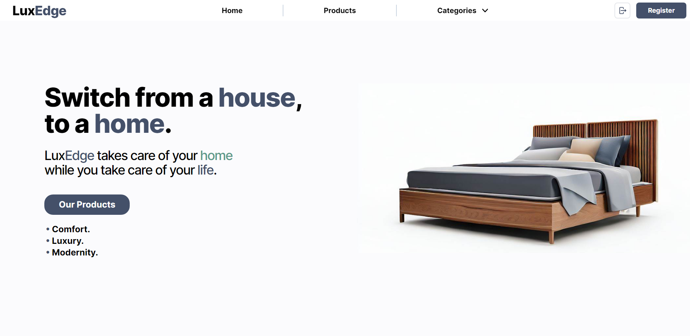

# LuxEdge 🛋️

LuxEdge is a furniture e-commerce template built with React.js, Node.js and TypeScript. It's a fully responsive website, with a clean and modern design. It's also fully customizable, so you can easily change the colors and the content of the website.

## Front-End

The frontend is built with React (TypeScript) using:

-   [Vite](https://vitejs.dev/)
-   [React-Router](https://reactrouter.com/)
-   [Axios](https://axios-http.com/)
-   [TailwindCSS](https://tailwindcss.com/)
-   [Redux](https://redux.js.org/)
-   [Redux-Toolkit](https://redux-toolkit.js.org/)
-   [curse-filter](https://www.npmjs.com/package/curse-filter)
-   [Framer Motion](https://www.framer.com/motion/)
-   [js-cookie](https://www.npmjs.com/package/js-cookie)
-   [lottie-web](https://www.npmjs.com/package/lottie-web)
-   [zod](https://zod.dev/)

<table style="width: 100%; border: none; margin: 2rem 0" cellspacing="0" cellpadding="0" border="0">
    <tr>
        <td style="width: 50%; border: none!important;" valign="center">
            
        </td>
        <td style="width: 50%; border: none!important;" valign="center">
            
        </td>
    </tr>
<table>

## React App Scripts

In the project directory, you can run:

### `npm run dev`

Runs the app in the development mode.\
Open [http://localhost:3000](http://localhost:3000) to view it in the browser.

The page will reload if you make edits.\
You will also see any lint errors in the console.

### `npm run build`

Builds the app for production to the `build` folder.\
It correctly bundles React in production mode and optimizes the build for the best performance.

The build is minified and the filenames include the hashes.\
Your app is ready to be deployed!

### `npm run lint`

Lints the app with EsLint.

### `npm run preview`

Runs the app in the production mode.

   

## About me 🧙‍♂️

I'm Alex 🪐, a highschool student from Italy. I'm a self-taught developer and I'm currently studying web development, using React ⚛️, NodeJS and Typescript.
I always try to learn the newest technologies and I'm always open to new ideas and projects. Fell free to contact me for any questions or suggestions.  Get to know me at alessandrofoglia07@gmail.com!

### 🛠️ Technologies I use the most 🛠️

